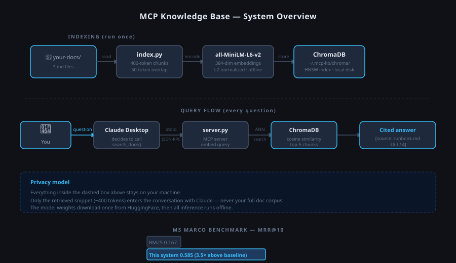

# MCP Knowledge Base


**[mcp-kb-site.vercel.app](https://mcp-kb-site.vercel.app)**

An MCP server that gives Claude Desktop semantic search over your private markdown docs — runbooks, API references, onboarding guides — without uploading them anywhere. Ask a question, get an answer with an exact line citation from your actual files.

---

## Why I built this

I was applying to Anthropic and DevRev. Both had MCP in the job description. I'd read the spec but hadn't built anything with it, so I picked a real problem to solve — internal docs being invisible to AI — and built this over a few weeks to understand the protocol from the inside.

The thing I kept thinking about while building it: most RAG demos tell you an answer but don't tell you where it came from. That's fine for a demo, not fine for a team relying on it. So every result in this comes with a line number. You can open the file and verify it yourself.

---

## System Architecture

### Indexing Pipeline — run once, fully offline



Run `index.py` once. Point the MCP server at Claude Desktop. Ask questions — get answers from your actual files with line citations.

---

## Quickstart

```bash
git clone https://github.com/karthikreddyyalala/MCP_Base.git
cd MCP_Base
pip install -e .

# Index the included example docs
python3 index.py --docs ./example-docs

# Confirm the server starts and lists its tools
printf '{"jsonrpc":"2.0","id":1,"method":"initialize","params":{"protocolVersion":"2024-11-05","capabilities":{},"clientInfo":{"name":"test","version":"0"}}}\n' \
  | PYTHONPATH=. python3 src/server.py
```

---

## Connect to Claude Desktop

Add this to `~/Library/Application Support/Claude/claude_desktop_config.json` (Mac) or `%APPDATA%\Claude\claude_desktop_config.json` (Windows):

```json
{
  "mcpServers": {
    "knowledge-base": {
      "command": "python3",
      "args": ["/absolute/path/to/MCP_Base/src/server.py"],
      "env": {
        "PYTHONPATH": "/absolute/path/to/MCP_Base",
        "KB_DOCS_PATH": "/absolute/path/to/your/docs",
        "KB_DB_PATH": "/Users/yourname/.mcp-kb/chroma"
      }
    }
  }
}
```

Restart Claude Desktop. You'll see a hammer icon in the chat input — that's your knowledge base. Try:

- *"What docs do you have access to?"*
- *"How do I roll back a bad deployment?"*
- *"What authentication does the API require?"*

---

## Example output

```
[source: deployment-runbook.md:L8-L14]
If error rate spikes, run rollback: ./scripts/rollback.sh <previous-sha>
This redeploys the previous image tag. Takes ~3 minutes. Notify #incidents in Slack.
```

The citation tells you exactly where in the file that answer came from. You can verify it, share it, or update it.

---

## Tools

| Tool | What it does |
|------|-------------|
| `search_docs(query)` | Semantic search over indexed docs. Returns top-5 chunks with `[source: file.md:L42-L58]` citations. |
| `list_docs()` | Lists every markdown file currently in the index. |

---

## Observability with Arize Phoenix

When tracing is enabled, every `search_docs` call is recorded as a retrieval span in [Arize Phoenix](https://phoenix.arize.com/) — the open-source LLM observability platform used in production at teams like Replit and Harvey. You can see exactly which chunks were retrieved for each query, spot retrieval failures, and diagnose why a bad answer was returned.

```bash
# Install the tracing extra
pip install -e ".[tracing]"

# Terminal 1 — start the Phoenix UI (opens http://localhost:6006)
python3 -m phoenix.server.main serve

# Terminal 2 — run the MCP server with tracing on
PHOENIX_ENABLED=1 PYTHONPATH=. python3 src/server.py
```

Every query from Claude Desktop now shows up as a span in the Phoenix trace view with the query text, retrieved chunk sources, and citation metadata.

---

## Technical decisions worth knowing about

**Why ChromaDB over Pinecone?** The README promise is "deploy in 5 minutes." Requiring a Pinecone signup breaks that. ChromaDB is a single pip install, stores vectors on disk, and needs no account. The right tool for local-first software.

**Why `all-MiniLM-L6-v2`?** It's 80MB, downloads once, runs fully offline after that, and produces strong semantic embeddings for English prose. For a knowledge base over internal documentation, it's more than sufficient.

**Why line-range citations?** A RAG system that tells you something without telling you where it came from is a liability. Line numbers mean you can open the source file, verify the answer, and notice when documentation is out of date.

**Why 400-token chunks with 50-token overlap?** Long enough to capture full thoughts, short enough to retrieve precisely. The overlap prevents context from being cut at chunk boundaries.

**Why Arize Phoenix over RAGAS?** This server is a retriever — Claude handles generation downstream. RAGAS's headline metrics (`faithfulness`, `answer_relevancy`) score generation quality, which is a component this project doesn't control. Its LLM-judged scoring also requires an API key that would break the offline guarantee. Phoenix gives span-level retrieval observability — the right instrument for the right layer — and runs fully locally with no account required.

---

## Stack

| Component | Library |
|-----------|---------|
| MCP server | [`mcp`](https://github.com/anthropics/mcp) — Anthropic's official SDK |
| Vector store | [`chromadb`](https://www.trychroma.com/) — local, no account |
| Embeddings | [`sentence-transformers`](https://www.sbert.net/) `all-MiniLM-L6-v2` |
| CLI | [`typer`](https://typer.tiangolo.com/) |

---

## Using your own docs

```bash
python3 index.py --docs /path/to/your/docs --db /path/to/store/vectors
```

Update `KB_DOCS_PATH` and `KB_DB_PATH` in the Claude Desktop config to match. Re-run `index.py` whenever your docs change — it rebuilds the index from scratch each time.

---

## Tests

```bash
pytest tests/ -v
```

10 tests covering chunking logic (including header-aware behavior), index construction, search result format, citation format, and source listing.

---

## Benchmark

MS MARCO passage ranking, dev set. Streams the 8.8M-passage corpus, reservoir-samples 1.1M (keeping all qrel-relevant passages), indexes, evaluates MRR@10 against the 6,980 official queries.

```
MRR@10 = 0.585   ████████████████████████████████████████████████████
BM25   = 0.167   ██████████████

3.5× above the keyword-search baseline.
Corpus: 1,100,000 passages · Queries: 6,980
```

First run ~90 min (sampling + indexing). Subsequent runs ~20 min (cached index). Stored at `~/.mcp-kb/msmarco`.

```bash
pip install -e ".[benchmark]"
PYTHONPATH=. python3 scripts/eval_msmarco.py
```

### Quick smoke test

```bash
PYTHONPATH=. python3 scripts/eval_msmarco.py --smoke
```

Streams full corpus (~3 min) but indexes only 10K passages and evaluates 50 queries. Verifies the pipeline end-to-end.

### Example doc smoke test

```bash
PYTHONPATH=. python3 eval.py --docs ./example-docs
```

```
Metric             Value
-------------------------
Recall@5           1.000  (20/20)
MRR                0.925
```

20 gold questions across the 3 bundled example docs. Useful for verifying chunking behavior after changes — not a meaningful benchmark (9 chunks total).
