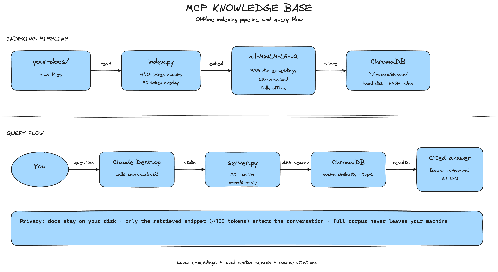

# MCP Knowledge Base


**[mcp-kb-site.vercel.app](https://mcp-kb-site.vercel.app)**

Give Claude Desktop semantic search over your private markdown docs. Ask a question, get a cited answer from your actual files — nothing uploaded anywhere.

---

## The problem

Your team has docs. Runbooks, onboarding guides, API references. Claude has no idea they exist.

You could upload them manually every conversation. But that sends your internal files to a third-party server, and you'd have to do it every time. This is the alternative: index them once locally, wire up the MCP server, and Claude can search them on its own whenever it needs to.

---

## How it works



Two steps:

**Index** — run `index.py` once. It reads your `.md` files, splits them into 400-token chunks (50-token overlap so nothing gets cut mid-sentence), embeds each chunk with `all-MiniLM-L6-v2`, and saves everything to ChromaDB on your local disk. The model downloads once from HuggingFace, then all inference is offline.

**Serve** — `server.py` runs in the background and registers two tools with Claude Desktop over stdio: `search_docs` and `list_docs`. When you ask Claude a question, it calls `search_docs`, gets back the top 5 relevant chunks with line citations, and answers from there.

The docs never leave your machine. Only the retrieved snippet (one paragraph, basically) enters the conversation.

---

## Quickstart

```bash
git clone https://github.com/karthikreddyyalala/MCP_Knowledge_Base.git
cd MCP_Knowledge_Base
pip install -e .

python3 index.py --docs ./example-docs
```

Test the server starts:
```bash
printf '{"jsonrpc":"2.0","id":1,"method":"initialize","params":{"protocolVersion":"2024-11-05","capabilities":{},"clientInfo":{"name":"test","version":"0"}}}\n' \
  | PYTHONPATH=. python3 src/server.py
```

---

## Connect to Claude Desktop

`~/Library/Application Support/Claude/claude_desktop_config.json` on Mac:

```json
{
  "mcpServers": {
    "knowledge-base": {
      "command": "python3",
      "args": ["/absolute/path/to/src/server.py"],
      "env": {
        "PYTHONPATH": "/absolute/path/to/MCP_Knowledge_Base",
        "KB_DOCS_PATH": "/path/to/your/docs",
        "KB_DB_PATH": "/Users/yourname/.mcp-kb/chroma"
      }
    }
  }
}
```

Restart Claude Desktop. Hammer icon appears in the chat input. Try asking: *"how do I roll back a bad deployment?"*

---

## What you get back

```
[source: deployment-runbook.md:L8-L14]
If error rate spikes, run rollback: ./scripts/rollback.sh <previous-sha>
Takes ~3 minutes. Notify #incidents in Slack.
```

Line number means you can open the file and verify it. That matters more than it sounds — a system that tells you something without telling you where it came from is one you can't trust in production.

---

## Tools

| Tool | What it does |
|------|-------------|
| `search_docs(query)` | Semantic search, returns top-5 chunks with `[source: file.md:L42-L58]` |
| `list_docs()` | Lists every indexed markdown file |

---

## Tracing with Arize Phoenix

```bash
pip install -e ".[tracing]"
python3 -m phoenix.server.main serve   # opens http://localhost:6006
PHOENIX_ENABLED=1 PYTHONPATH=. python3 src/server.py
```

Shows every `search_docs` call as a retrieval span — query text, which chunks were returned, citation metadata. Useful for debugging why a bad answer came back.

Used Phoenix over RAGAS because this project is a retriever, not a generator. RAGAS measures generation quality (`faithfulness`, `answer_relevancy`) which Claude handles downstream — and it needs an API key, which breaks the offline guarantee.

---

## Decisions

**ChromaDB not Pinecone** — Pinecone needs an account. ChromaDB is one pip install, stores on disk, zero setup. For a local-first tool that's the right call.

**all-MiniLM-L6-v2** — 80MB, downloads once, runs offline forever. Strong enough for English prose docs.

**400-token chunks, 50-token overlap** — big enough to capture a full thought, small enough to retrieve precisely. Overlap means nothing important gets split across a boundary.

**Line citations not just filenames** — filenames tell you which doc. Line numbers tell you exactly where, so you can verify and notice when docs go stale.

---

## Stack

| | |
|---|---|
| MCP server | [`mcp`](https://github.com/anthropics/mcp) |
| Vector store | [`chromadb`](https://www.trychroma.com/) |
| Embeddings | `sentence-transformers` — `all-MiniLM-L6-v2` |
| Observability | [Arize Phoenix](https://phoenix.arize.com/) |
| CLI | `typer` |

---

## Tests

```bash
pytest tests/ -v
```

10 tests — chunking logic, index construction, search result format, citation format, source listing.

---

## Benchmark

MS MARCO passage ranking, dev set. Reservoir-sampled 1.1M passages from the full 8.8M corpus (keeping all qrel-relevant passages), indexed, then evaluated MRR@10 against 6,980 official queries.

```
MRR@10 = 0.585   ████████████████████████████████████████████████████
BM25   = 0.167   ██████████████

3.5× above the keyword search baseline.
```

First run ~90 min. Subsequent runs ~20 min (cached index at `~/.mcp-kb/msmarco`).

```bash
pip install -e ".[benchmark]"
PYTHONPATH=. python3 scripts/eval_msmarco.py
```
