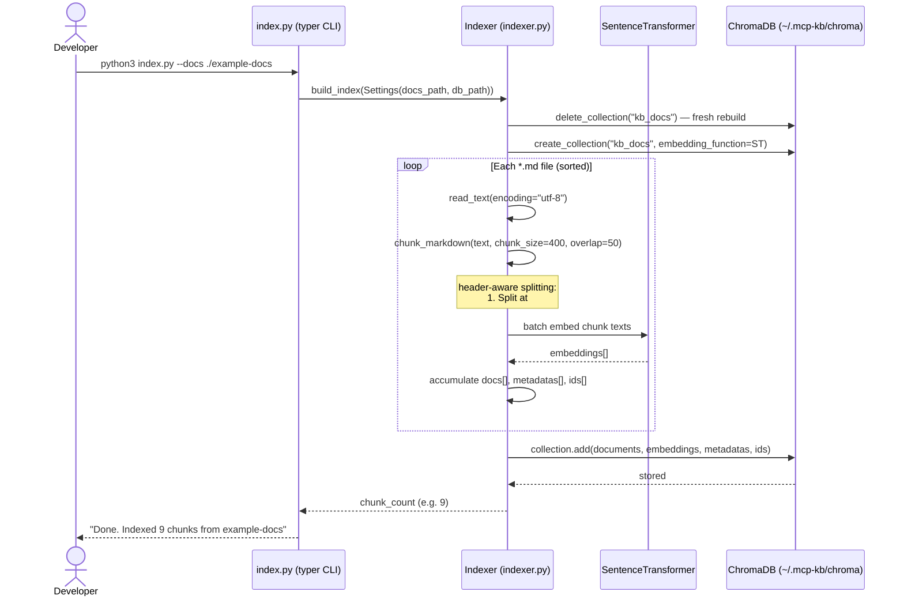

# Indexing Sequence



## Chunk metadata stored per chunk

| Field | Example | Purpose |
|-------|---------|---------|
| `source` | `deployment-runbook.md` | File-level attribution |
| `start_line` | `8` | Start of chunk in source file |
| `end_line` | `14` | End of chunk — forms `L8-L14` citation |

## Header-aware chunking example

Input:
```markdown
## Rollback Procedure

If error rate spikes, run rollback: ./scripts/rollback.sh <sha>
Takes ~3 minutes. Notify #incidents in Slack.
```

Output chunk:
```
## Rollback Procedure

If error rate spikes, run rollback: ./scripts/rollback.sh <sha> Takes ~3 minutes. Notify #incidents in Slack.
```

Without the header prefix, a chunk starting mid-section would lose all section context.
