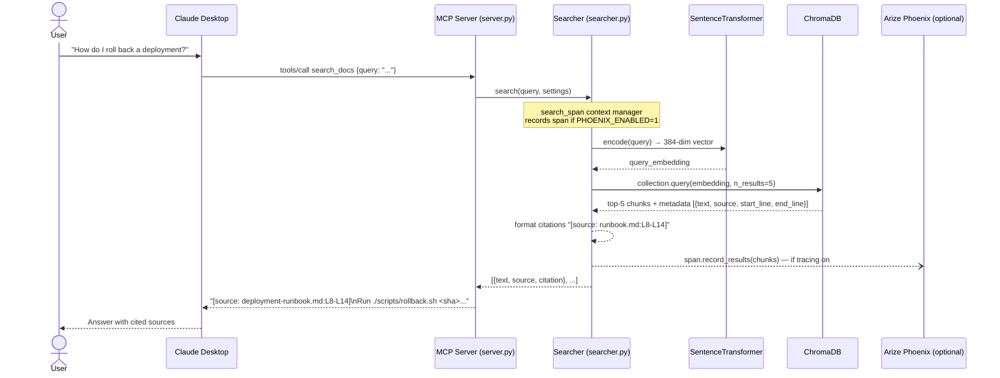

# Search Query Sequence

## Key design decisions

- **stdio transport**: MCP server communicates over stdin/stdout — zero network setup, works natively with Claude Desktop
- **Citation format**: `[source: filename.md:L42-L58]` is included in every result so Claude can include it in its answer
- **Top-5 retrieval**: ChromaDB returns 5 chunks; Claude sees all and synthesizes
- **Optional tracing**: `search_span` is a no-op context manager unless `PHOENIX_ENABLED=1` — zero overhead by default
