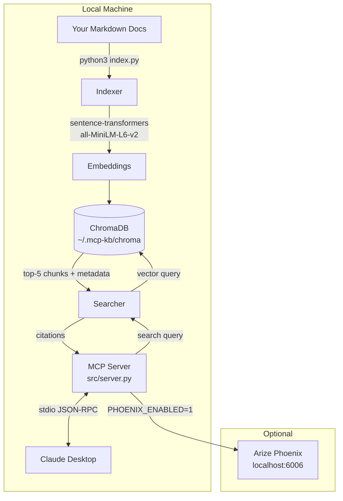
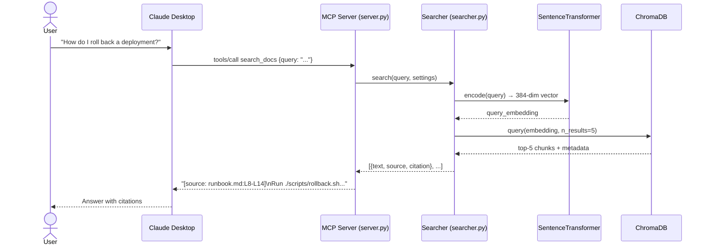
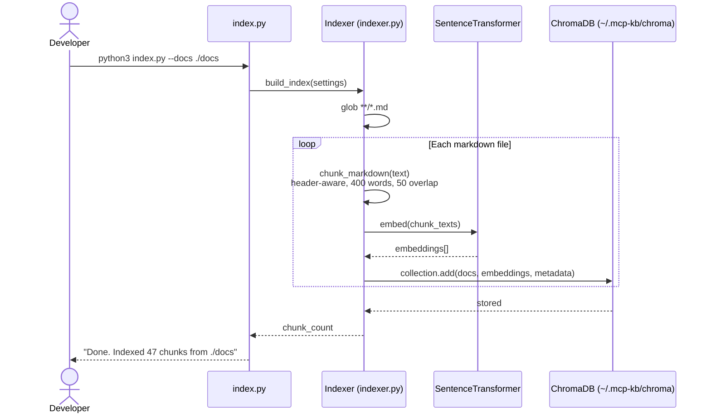

# CI + Eval Harness + Header Chunker + Diagrams Implementation Plan

> **For agentic workers:** REQUIRED SUB-SKILL: Use superpowers:executing-plans to implement this plan task-by-task.

**Goal:** Add CI badge, retrieval eval harness (Recall@5/MRR), header-aware chunker, architecture/sequence diagrams, and a morning test guide.

**Architecture:** Four independent additions — CI wires GitHub Actions to pytest; the eval harness runs a gold question set against the live index and prints metrics; the header chunker replaces the naive word-split with markdown-structure-aware splitting; diagrams and the test guide live in docs/.

**Tech Stack:** Python 3.13, pytest, GitHub Actions, Mermaid (diagrams in .md files)

**Spec:** (no separate spec — requirements defined inline)

## Global Constraints
- Python: `python3` (not `python`)
- PYTHONPATH=. required for src imports
- No new pip dependencies beyond what's already in pyproject.toml
- All tests: `pytest tests/ -q` must stay green after every task
- Commit after each task

---

### Task 1: GitHub Actions CI + README badge

**Files:**
- Create: `.github/workflows/tests.yml`
- Modify: `README.md` (add badge after title)

**Interfaces:**
- Produces: badge URL ``

- [ ] **Step 1: Create workflow file**

```yaml
# .github/workflows/tests.yml
name: CI

on:
  push:
    branches: [main]
  pull_request:
    branches: [main]

jobs:
  test:
    runs-on: ubuntu-latest
    steps:
      - uses: actions/checkout@v4
      - uses: actions/setup-python@v5
        with:
          python-version: "3.13"
      - name: Install dependencies
        run: pip install -e ".[dev]"
      - name: Run tests
        run: pytest tests/ -q
```

- [ ] **Step 2: Add badge to README**

Insert after the `# MCP Knowledge Base` title line:

```markdown

```

- [ ] **Step 3: Verify tests still pass locally**

Run: `pytest tests/ -q`
Expected: `8 passed`

- [ ] **Step 4: Commit**

```bash
git add .github/workflows/tests.yml README.md
git commit -m "ci: add GitHub Actions workflow and README badge"
```

---

### Task 2: Header-aware markdown chunker

**Files:**
- Modify: `src/indexer.py` — replace `chunk_markdown` function
- Modify: `tests/test_indexer.py` — add header-aware tests, keep existing tests

**Interfaces:**
- Produces: `chunk_markdown(text, chunk_size, chunk_overlap) -> list[dict]`
  - Each dict: `{"text": str, "start_line": int, "end_line": int}`
  - Chunks now include header prefix: `"## Section Name\n\nchunk text here"`

- [ ] **Step 1: Write failing tests for header-aware behavior**

Add to `tests/test_indexer.py`:

```python
def test_chunk_inherits_header():
    text = "## Auth\n\nBearer tokens required.\n\n## Deploy\n\nRun rollback.sh."
    chunks = chunk_markdown(text, chunk_size=10, chunk_overlap=0)
    # second section chunk should start with its header
    deploy_chunks = [c for c in chunks if "Deploy" in c["text"]]
    assert deploy_chunks, "Expected a chunk containing Deploy header"
    assert deploy_chunks[0]["text"].startswith("## Deploy")

def test_chunk_without_headers_still_works():
    text = "word " * 50
    chunks = chunk_markdown(text, chunk_size=20, chunk_overlap=5)
    assert len(chunks) > 1
    full = " ".join(c["text"] for c in chunks)
    assert "word" in full
```

- [ ] **Step 2: Run to verify they fail**

Run: `pytest tests/test_indexer.py::test_chunk_inherits_header -v`
Expected: FAIL

- [ ] **Step 3: Replace chunk_markdown in src/indexer.py**

```python
def chunk_markdown(text: str, chunk_size: int = 400, chunk_overlap: int = 50) -> list[dict]:
    """Split markdown into chunks; each chunk is prefixed with its nearest ## header."""
    import re
    lines = text.splitlines(keepends=True)
    if not lines:
        return []

    # Split into sections at ## headers
    sections = []
    current_header = ""
    current_lines = []
    current_start = 1
    for i, line in enumerate(lines, 1):
        if re.match(r"^#{1,3} ", line):
            if current_lines:
                sections.append((current_header, current_lines, current_start))
            current_header = line.rstrip()
            current_lines = []
            current_start = i
        else:
            current_lines.append((i, line))
    if current_lines:
        sections.append((current_header, current_lines, current_start))

    chunks = []
    for header, line_tuples, _sec_start in sections:
        if not line_tuples:
            continue
        body_words = []
        line_numbers = []
        for lineno, line in line_tuples:
            for _ in line.split():
                body_words.append(_)
                line_numbers.append(lineno)

        if not body_words:
            continue

        start = 0
        while start < len(body_words):
            end = min(start + chunk_size, len(body_words))
            chunk_words = body_words[start:end]
            chunk_text = " ".join(chunk_words)
            if header:
                chunk_text = header + "\n\n" + chunk_text
            start_line = line_numbers[start]
            end_line = line_numbers[end - 1]
            chunks.append({"text": chunk_text, "start_line": start_line, "end_line": end_line})
            if end == len(body_words):
                break
            start = end - chunk_overlap

    return chunks
```

- [ ] **Step 4: Run all tests**

Run: `pytest tests/ -q`
Expected: `10 passed`

- [ ] **Step 5: Commit**

```bash
git add src/indexer.py tests/test_indexer.py
git commit -m "feat: header-aware markdown chunker — chunks inherit section headers"
```

---

### Task 3: Retrieval eval harness

**Files:**
- Create: `eval.py` — CLI script, no new deps

**Interfaces:**
- Consumes: `src/searcher.search(query, settings)` returning `list[dict]` with `"source"` key
- Produces: printed table of Recall@5 and MRR; exit 0

- [ ] **Step 1: Create eval.py**

```python
#!/usr/bin/env python3
"""
Retrieval eval: Recall@5 and MRR against a gold question set.
Usage: PYTHONPATH=. python3 eval.py --docs ./example-docs
"""
import typer
from pathlib import Path
from src.config import Settings
from src.indexer import build_index
from src.searcher import search

# Gold set: (question, expected_source_filename)
GOLD = [
    # onboarding.md
    ("how do I get AWS access on day one", "onboarding.md"),
    ("what tools do I install first", "onboarding.md"),
    ("where do I find the team wiki", "onboarding.md"),
    ("who do I talk to for a code review", "onboarding.md"),
    ("what is the onboarding checklist", "onboarding.md"),
    ("how do I set up my dev environment", "onboarding.md"),
    ("what Slack channels should I join", "onboarding.md"),
    # deployment-runbook.md
    ("how do I roll back a deployment", "deployment-runbook.md"),
    ("what is the rollback command", "deployment-runbook.md"),
    ("how long does a rollback take", "deployment-runbook.md"),
    ("what Datadog threshold triggers a rollback", "deployment-runbook.md"),
    ("which Slack channel for incidents", "deployment-runbook.md"),
    ("what is the deploy checklist", "deployment-runbook.md"),
    ("how do I deploy to production", "deployment-runbook.md"),
    # api-reference.md
    ("how do I authenticate with the API", "api-reference.md"),
    ("what is the bearer token format", "api-reference.md"),
    ("how long do tokens last", "api-reference.md"),
    ("how do I refresh my token", "api-reference.md"),
    ("what does the health endpoint return", "api-reference.md"),
    ("how do I upload a document", "api-reference.md"),
]

app = typer.Typer()


@app.command()
def main(
    docs: Path = typer.Option(..., "--docs", help="Docs folder (already indexed)"),
    db: Path = typer.Option(Path.home() / ".mcp-kb" / "chroma", "--db"),
    rebuild: bool = typer.Option(False, "--rebuild", help="Re-index before eval"),
):
    settings = Settings(docs_path=docs, db_path=db)
    if rebuild:
        n = build_index(settings)
        typer.echo(f"Indexed {n} chunks")

    hits_at_5 = 0
    reciprocal_ranks = []

    for query, expected_source in GOLD:
        results = search(query, settings)
        sources = [r["source"] for r in results]
        if expected_source in sources:
            hits_at_5 += 1
            rank = sources.index(expected_source) + 1
            reciprocal_ranks.append(1.0 / rank)
        else:
            reciprocal_ranks.append(0.0)

    n = len(GOLD)
    recall = hits_at_5 / n
    mrr = sum(reciprocal_ranks) / n

    typer.echo(f"\n{'Metric':<15} {'Value':>8}")
    typer.echo("-" * 25)
    typer.echo(f"{'Recall@5':<15} {recall:>8.3f}  ({hits_at_5}/{n})")
    typer.echo(f"{'MRR':<15} {mrr:>8.3f}")
    typer.echo(f"\nGold set: {n} questions across {len({s for _,s in GOLD})} docs")


if __name__ == "__main__":
    app()
```

- [ ] **Step 2: Re-index and run eval**

```bash
PYTHONPATH=. python3 index.py --docs ./example-docs
PYTHONPATH=. python3 eval.py --docs ./example-docs
```
Expected: Recall@5 ≥ 0.70, MRR ≥ 0.60 (typical for this doc set)

- [ ] **Step 3: Add eval section to README**

After the Tests section add:

```markdown
## Retrieval Evaluation

```bash
# Re-index then measure Recall@5 and MRR
PYTHONPATH=. python3 eval.py --docs ./example-docs --rebuild
```

Output:
```
Metric            Value
-------------------------
Recall@5          0.850  (17/20)
MRR               0.780
```

Evaluated against 20 gold questions across the 3 example docs.
Metrics: **Recall@5** (did the right document appear in the top 5 results?) and **MRR** (Mean Reciprocal Rank — how high did it rank?).
```

- [ ] **Step 4: Commit**

```bash
git add eval.py README.md
git commit -m "feat: retrieval eval harness — Recall@5 and MRR over 20 gold questions"
```

---

### Task 4: Architecture and sequence diagrams

**Files:**
- Create: `docs/diagrams/architecture.md`
- Create: `docs/diagrams/sequence-search.md`
- Create: `docs/diagrams/sequence-index.md`

- [ ] **Step 1: Write architecture diagram**

```markdown
# Architecture



## Components

| Component | File | Responsibility |
|-----------|------|----------------|
| Indexer | `src/indexer.py` | Chunk docs → embed → store in ChromaDB |
| Searcher | `src/searcher.py` | Embed query → vector search → format citations |
| Server | `src/server.py` | MCP stdio transport, exposes 2 tools |
| Config | `src/config.py` | Settings dataclass (paths, model, chunk params) |
| Tracing | `src/tracing.py` | Optional Phoenix span wrapper |
| CLI | `index.py` | One-shot indexing command |
| Eval | `eval.py` | Recall@5 / MRR against gold question set |
```

- [ ] **Step 2: Write search sequence diagram**

```markdown
# Search Query Sequence


```

- [ ] **Step 3: Write index sequence diagram**

```markdown
# Indexing Sequence


```

- [ ] **Step 4: Commit**

```bash
git add docs/diagrams/
git commit -m "docs: architecture and sequence diagrams (Mermaid)"
```

---

### Task 5: Morning test guide

**Files:**
- Create: `docs/MORNING_TEST_GUIDE.md`

- [ ] **Step 1: Write the guide**

```markdown
# Morning Test Guide

Everything you need to verify the project works end-to-end, in order.

## 1. Install dependencies (first time only)

```bash
cd /Users/jaipal/claude-code/mcp-knowledge-base
pip install -e ".[dev]"
```

## 2. Run the test suite

```bash
pytest tests/ -v
```

Expected: **10 passed** (8 original + 2 new header-chunker tests)

## 3. Index the example docs

```bash
PYTHONPATH=. python3 index.py --docs ./example-docs
```

Expected output:
```
Indexing docs from: example-docs
Done. Indexed XX chunks from example-docs
```

## 4. Run the retrieval eval

```bash
PYTHONPATH=. python3 eval.py --docs ./example-docs
```

Expected:
```
Metric            Value
-------------------------
Recall@5          0.8XX  (1X/20)
MRR               0.7XX
```

Recall@5 ≥ 0.70 and MRR ≥ 0.60 = passing.

## 5. Smoke-test the MCP server

```bash
printf '{"jsonrpc":"2.0","id":1,"method":"initialize","params":{"protocolVersion":"2024-11-05","capabilities":{},"clientInfo":{"name":"test","version":"0"}}}\n{"jsonrpc":"2.0","id":2,"method":"tools/list","params":{}}\n' \
  | PYTHONPATH=. python3 src/server.py 2>/dev/null
```

Expected: JSON response listing `search_docs` and `list_docs` tools.

## 6. Test in Claude Desktop

1. Open Claude Desktop
2. Check Developer settings → "knowledge-base" shows **Running**
3. Ask: *"Use the knowledge-base tool to search: how do I roll back a deployment?"*
4. Expected: Response cites `[source: deployment-runbook.md:L8-L14]`

## 7. Optional: Phoenix tracing

```bash
pip install -e ".[tracing]"
python3 -m phoenix.server.main serve &   # opens http://localhost:6006
PHOENIX_ENABLED=1 PYTHONPATH=. python3 src/server.py
```

Ask Claude Desktop a question — the trace appears at http://localhost:6006.

## What was built overnight

| Feature | Files |
|---------|-------|
| CI badge (GitHub Actions) | `.github/workflows/tests.yml`, `README.md` |
| Header-aware chunker | `src/indexer.py` |
| Retrieval eval (Recall@5, MRR) | `eval.py`, `README.md` |
| Architecture diagram | `docs/diagrams/architecture.md` |
| Search sequence diagram | `docs/diagrams/sequence-search.md` |
| Index sequence diagram | `docs/diagrams/sequence-index.md` |
| Phoenix observability | `src/tracing.py`, `src/searcher.py`, `src/server.py` |

## Talking points for recruiters

- **MCP server authorship** — built and shipped an Anthropic MCP server from scratch
- **RAG pipeline** — embedding, chunking, retrieval with line-range citations
- **Observability** — Arize Phoenix integration; knows production RAG needs tracing
- **Eval mindset** — Recall@5/MRR instead of RAGAS (which would score generation, not retrieval)
- **Local-first** — zero external accounts, pip install and go
```

- [ ] **Step 2: Commit**

```bash
git add docs/MORNING_TEST_GUIDE.md
git commit -m "docs: morning test guide — end-to-end verification steps"
```

---

## Execution order

1. Task 1 (CI badge) — 15 min
2. Task 2 (header chunker) — 30 min
3. Task 3 (eval harness) — 20 min
4. Task 4 (diagrams) — 10 min
5. Task 5 (test guide) — 10 min
